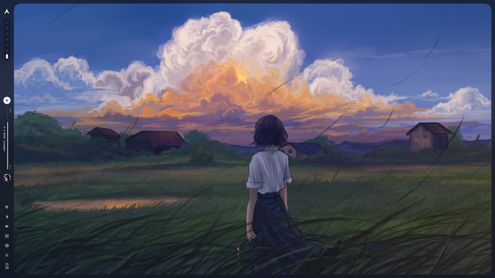
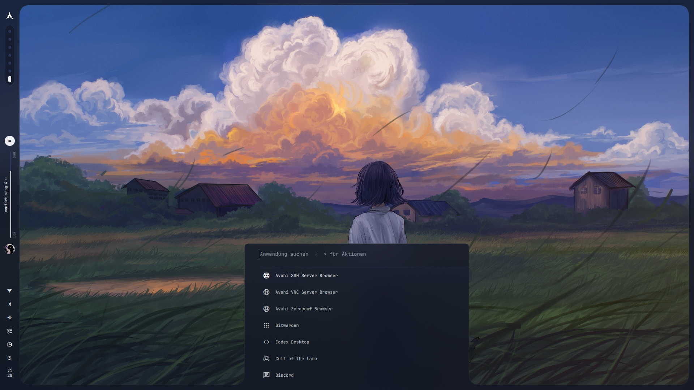
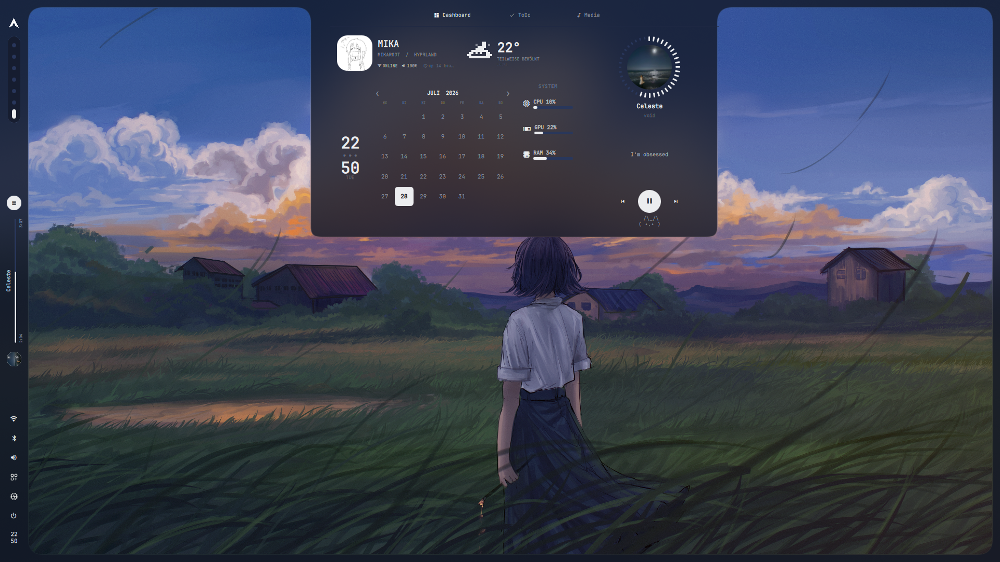
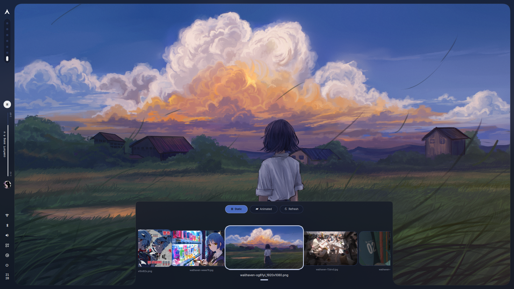

# Hyprland + Quickshell dotfiles

My Arch desktop configuration. The shell is written in QML with Quickshell;
Hyprland handles the compositor, workspaces and window rules.

This is the setup I use, not a generic Hyprland starter pack. It assumes two
1080p monitors and includes a few machine-specific defaults. Read the notes
below before installing it.



| Launcher | Dashboard |
| --- | --- |
|  |  |



## What is here

- vertical bar with workspaces, media, tray and system controls
- launcher, notification center, network menu and audio mixer
- top island with calendar, weather, media controls, to-do list and metrics
- static and animated wallpaper picker
- lock screen and SDDM theme
- matching Kitty, GTK, Qt6ct, Fastfetch and Spicetify configuration
- optional Ollama chat and GMX unread counter

The Quickshell entry point is
[`.config/quickshell/shell.qml`](.config/quickshell/shell.qml). Hyprland is
configured in [`.config/hypr/hyprland.lua`](.config/hypr/hyprland.lua).

## Before you install

The current Hyprland config expects:

- `DP-1` at `1920x1080@240`, placed at `0x0`
- `HDMI-A-1` at `1920x1080@180`, placed at `1920x0`
- workspaces 1–7 on the left monitor
- workspace 10 on the right monitor
- an AMD GPU at PCI address `0000:03:00.0` for the metrics scripts
- Kitty as the terminal and Dolphin as the file manager

Change those values for your machine. Use `hyprctl monitors` to find your
output names.

Core commands used by the config:

```text
Hyprland  qs  awww  kitty  nmcli  playerctl  wpctl  python3
```

Optional parts use `fastfetch`, `ffmpeg`, `hypridle`, `hyprlock`, `ollama`,
`qt6ct` and `spicetify`. The theme also expects JetBrainsMono Nerd Font,
Adwaita Sans, Papirus-Dark and capitaine-cursors.

## Install

Clone the repo somewhere you want to keep it:

```bash
git clone https://github.com/mika2go/dotfiles.git ~/.local/share/mika-dotfiles
cd ~/.local/share/mika-dotfiles
```

Check what the installer would replace:

```bash
./install.sh --dry-run
```

Then install the user configuration:

```bash
./install.sh
```

Existing paths are moved to:

```text
~/.local/state/mika-dotfiles/backups/<timestamp>/
```

The installer rewrites `/home/mika` to the current user's home directory. It
does not install packages.

The SDDM files require root and are opt-in:

```bash
./install.sh --with-sddm
```

Run `./install.sh --check` to see which commands are missing.

## Weather

The weather helper reads its location from a local state file outside the
repository:

```bash
mkdir -p ~/.local/state/quickshell-weather
cp .config/quickshell/weather.json.example \
  ~/.local/state/quickshell-weather/config.json
```

Set a display label, latitude and longitude in `config.json`. The private file
is never installed or tracked by the repository.

## Keybinds

| Key | Action |
| --- | --- |
| `SUPER + D` | launcher |
| `SUPER + W` | dashboard |
| `SUPER + B` | wallpaper picker |
| `SUPER + S` | audio mixer |
| `SUPER + N` | notifications |
| `SUPER + E` | file explorer |
| `SUPER + M` | power menu |
| `SUPER + L` | lock screen |
| `SUPER + I` | keybind list |

The complete list is in `.config/hypr/hyprland.lua`.

## GMX unread counter

The mail helper reads credentials from a local file that is not part of this
repo:

```bash
install -Dm600 /dev/null ~/.local/state/quickshell-gmx/credentials
```

Add:

```text
GMX_EMAIL=your-address@gmx.de
GMX_PASSWORD=your-app-password
```

It only asks IMAP for the number of unread messages. It does not fetch
subjects, senders or message bodies.

## Local chat

The notification center can use a local Ollama server. The default model is
`qwen3.5:4b`. Nothing else in the shell depends on Ollama.

## License and assets

My code and configuration files are under the [MIT License](LICENSE).
Material Symbols includes its own license in `.config/quickshell/assets/`.
Wallpapers, avatars and other third-party images remain the property of their
respective authors and are not covered by the MIT license.
